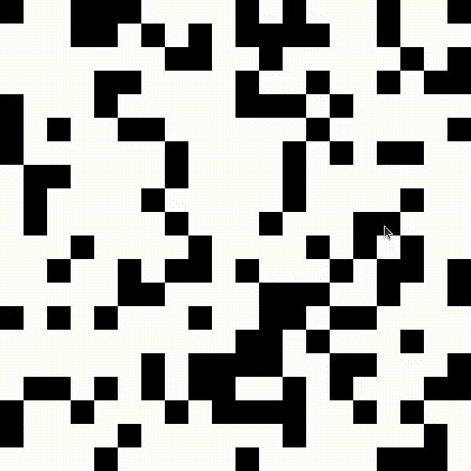
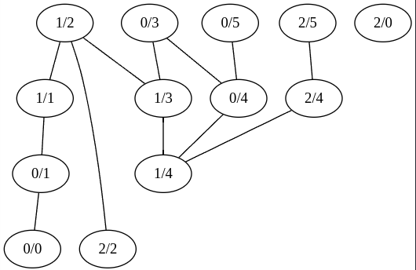

# GoMaze

*GoMaze* is a simple maze generator and solver written in *Go*. It randomly generate the maze and uses *Dijkstra algorithm* to find the minimum path between 2 points.

The library used to render the maze and manage inputs is [ebitengine](https://ebitengine.org/), a simple 2D game engine written in Go.
The minimum path is calculated using the [graph](https://pkg.go.dev/github.com/dominikbraun/graph#readme-getting-started) library.



# How to use

## How to run

```bash
go run cmd/main.go 
```

```bash
Flags:
-h int
    height of the maze (cells number) (default 20)
-w int
    width of the maze (cells number) (default 20) 
```

## How to play

- *Click* on the maze with the *left mouse button* to set the *start* and the *ending* point. 
- Press *R* on the keyboard to *generate* a new maze.

# How it works

To find the minimum path between 2 points, the program uses the *Dijkstra algorithm*. Every walkable cell of the matrix (representing the maze), have been added to a graph. The weight of the edges is the distance between 2 cells, which is always 1. The algorithm will find the shortest path between the 2 points by exploring the graph.

This is an example of the generated graph:




